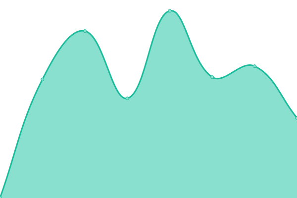
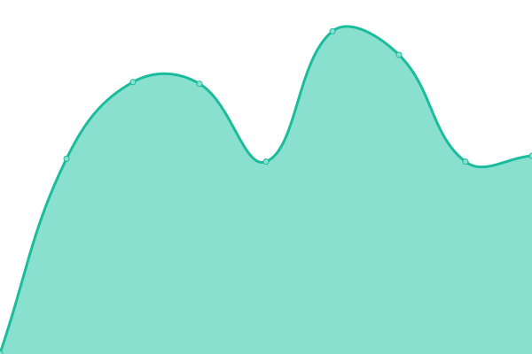

# [📈 Live Status](https://xnaas.github.io/nitter-instances): <!--live status--> **🟧 Partial outage**

This repository contains the open-source uptime monitor and status page for [xnaas](https://xnaas.info/), powered by [Upptime](https://github.com/upptime/upptime).

With [Upptime](https://upptime.js.org), you can get your own unlimited and free uptime monitor and status page, powered entirely by a GitHub repository. We use [Issues](https://github.com/xnaas/nitter-instances/issues) as incident reports, [Actions](https://github.com/xnaas/nitter-instances/actions) as uptime monitors, and [Pages](https://xnaas.github.io/nitter-instances) for the status page.

<!--start: status pages-->
<!-- This summary is generated by Upptime (https://github.com/upptime/upptime) -->
<!-- Do not edit this manually, your changes will be overwritten -->
<!-- prettier-ignore -->
| URL | Status | History | Response Time | Uptime |
| --- | ------ | ------- | ------------- | ------ |
|  [nitter.42l.fr](https://nitter.42l.fr) | 🟩 Up | [nitter-42l-fr.yml](https://github.com/xnaas/nitter-instances/commits/HEAD/history/nitter-42l-fr.yml) | 

 781ms
     
 | 

<a href="https://xnaas.github.io/nitter-instances/history/nitter-42l-fr">43.40%</a>
    

|  [nitter.pussthecat.org](https://nitter.pussthecat.org) | 🟩 Up | [nitter-pussthecat-org.yml](https://github.com/xnaas/nitter-instances/commits/HEAD/history/nitter-pussthecat-org.yml) | 

 566ms
     
 | 

<a href="https://xnaas.github.io/nitter-instances/history/nitter-pussthecat-org">100.00%</a>
    

|  [nitter.nixnet.services](https://nitter.nixnet.services) | 🟩 Up | [nitter-nixnet-services.yml](https://github.com/xnaas/nitter-instances/commits/HEAD/history/nitter-nixnet-services.yml) | 

 661ms
     
 | 

<a href="https://xnaas.github.io/nitter-instances/history/nitter-nixnet-services">100.00%</a>
    

|  [nitter.fdn.fr](https://nitter.fdn.fr) | 🟩 Up | [nitter-fdn-fr.yml](https://github.com/xnaas/nitter-instances/commits/HEAD/history/nitter-fdn-fr.yml) | 

 551ms
     
 | 

<a href="https://xnaas.github.io/nitter-instances/history/nitter-fdn-fr">100.00%</a>
    

|  [nitter.1d4.us](https://nitter.1d4.us) | 🟩 Up | [nitter-1d4-us.yml](https://github.com/xnaas/nitter-instances/commits/HEAD/history/nitter-1d4-us.yml) | 

 315ms
     
 | 

<a href="https://xnaas.github.io/nitter-instances/history/nitter-1d4-us">100.00%</a>
    

|  [nitter.kavin.rocks](https://nitter.kavin.rocks) | 🟩 Up | [nitter-kavin-rocks.yml](https://github.com/xnaas/nitter-instances/commits/HEAD/history/nitter-kavin-rocks.yml) | 

 649ms
     
 | 

<a href="https://xnaas.github.io/nitter-instances/history/nitter-kavin-rocks">99.81%</a>
    

|  [nitter.vxempire.xyz](https://nitter.vxempire.xyz) | 🟩 Up | [nitter-vxempire-xyz.yml](https://github.com/xnaas/nitter-instances/commits/HEAD/history/nitter-vxempire-xyz.yml) | 

 683ms
     
 | 

<a href="https://xnaas.github.io/nitter-instances/history/nitter-vxempire-xyz">100.00%</a>
    

|  [nitter.unixfox.eu](https://nitter.unixfox.eu) | 🟩 Up | [nitter-unixfox-eu.yml](https://github.com/xnaas/nitter-instances/commits/HEAD/history/nitter-unixfox-eu.yml) | 

 507ms
     
 | 

<a href="https://xnaas.github.io/nitter-instances/history/nitter-unixfox-eu">100.00%</a>
    

|  [nitter.domain.glass](https://nitter.domain.glass) | 🟩 Up | [nitter-domain-glass.yml](https://github.com/xnaas/nitter-instances/commits/HEAD/history/nitter-domain-glass.yml) | 

 208ms
     
 | 

<a href="https://xnaas.github.io/nitter-instances/history/nitter-domain-glass">100.00%</a>
    

|  [nitter.eu](https://nitter.eu) | 🟩 Up | [nitter-eu.yml](https://github.com/xnaas/nitter-instances/commits/HEAD/history/nitter-eu.yml) | 

 682ms
     
 | 

<a href="https://xnaas.github.io/nitter-instances/history/nitter-eu">100.00%</a>
    

|  [nitter.namazso.eu](https://nitter.namazso.eu) | 🟩 Up | [nitter-namazso-eu.yml](https://github.com/xnaas/nitter-instances/commits/HEAD/history/nitter-namazso-eu.yml) | 

 422ms
     
 | 

<a href="https://xnaas.github.io/nitter-instances/history/nitter-namazso-eu">100.00%</a>
    

|  [nitter.mailstation.de](https://nitter.mailstation.de) | 🟩 Up | [nitter-mailstation-de.yml](https://github.com/xnaas/nitter-instances/commits/HEAD/history/nitter-mailstation-de.yml) | 

 1017ms
     
 | 

<a href="https://xnaas.github.io/nitter-instances/history/nitter-mailstation-de">70.62%</a>
    

|  [nitter.actionsack.com](https://nitter.actionsack.com) | 🟩 Up | [nitter-actionsack-com.yml](https://github.com/xnaas/nitter-instances/commits/HEAD/history/nitter-actionsack-com.yml) | 

 283ms
     
 | 

<a href="https://xnaas.github.io/nitter-instances/history/nitter-actionsack-com">100.00%</a>
    

|  [birdsite.xanny.family](https://birdsite.xanny.family) | 🟩 Up | [birdsite-xanny-family.yml](https://github.com/xnaas/nitter-instances/commits/HEAD/history/birdsite-xanny-family.yml) | 

 623ms
     
 | 

<a href="https://xnaas.github.io/nitter-instances/history/birdsite-xanny-family">100.00%</a>
    

|  [nitter.hu](https://nitter.hu) | 🟩 Up | [nitter-hu.yml](https://github.com/xnaas/nitter-instances/commits/HEAD/history/nitter-hu.yml) | 

 723ms
     
 | 

<a href="https://xnaas.github.io/nitter-instances/history/nitter-hu">100.00%</a>
    

|  [nitter.exonip.de](https://nitter.exonip.de) | 🟥 Down | [nitter-exonip-de.yml](https://github.com/xnaas/nitter-instances/commits/HEAD/history/nitter-exonip-de.yml) | 

 1267ms
     
 | 

<a href="https://xnaas.github.io/nitter-instances/history/nitter-exonip-de">0.00%</a>
    

|  [twitr.gq](https://twitr.gq) | 🟥 Down | [twitr-gq.yml](https://github.com/xnaas/nitter-instances/commits/HEAD/history/twitr-gq.yml) | 

 502ms
     
 | 

<a href="https://xnaas.github.io/nitter-instances/history/twitr-gq">0.00%</a>
    

|  [nitter.koyu.space](https://nitter.koyu.space) | 🟩 Up | [nitter-koyu-space.yml](https://github.com/xnaas/nitter-instances/commits/HEAD/history/nitter-koyu-space.yml) | 

 3729ms
     
 | 

<a href="https://xnaas.github.io/nitter-instances/history/nitter-koyu-space">95.62%</a>
    

|  [nitter.moomoo.me](https://nitter.moomoo.me) | 🟩 Up | [nitter-moomoo-me.yml](https://github.com/xnaas/nitter-instances/commits/HEAD/history/nitter-moomoo-me.yml) | 

 198ms
     
 | 

<a href="https://xnaas.github.io/nitter-instances/history/nitter-moomoo-me">100.00%</a>
    

|  [bird.trom.tf](https://bird.trom.tf) | 🟩 Up | [bird-trom-tf.yml](https://github.com/xnaas/nitter-instances/commits/HEAD/history/bird-trom-tf.yml) | 

 557ms
     
 | 

<a href="https://xnaas.github.io/nitter-instances/history/bird-trom-tf">93.40%</a>
    

|  [nitter.it](https://nitter.it) | 🟩 Up | [nitter-it.yml](https://github.com/xnaas/nitter-instances/commits/HEAD/history/nitter-it.yml) | 

 509ms
     
 | 

<a href="https://xnaas.github.io/nitter-instances/history/nitter-it">94.18%</a>
    

|  [twitter.censors.us](https://twitter.censors.us) | 🟩 Up | [twitter-censors-us.yml](https://github.com/xnaas/nitter-instances/commits/HEAD/history/twitter-censors-us.yml) | 

 404ms
     
 | 

<a href="https://xnaas.github.io/nitter-instances/history/twitter-censors-us">100.00%</a>
    

|  [nitter.grimneko.de](https://nitter.grimneko.de) | 🟩 Up | [nitter-grimneko-de.yml](https://github.com/xnaas/nitter-instances/commits/HEAD/history/nitter-grimneko-de.yml) | 

 907ms
     
 | 

<a href="https://xnaas.github.io/nitter-instances/history/nitter-grimneko-de">100.00%</a>
    

|  [nitter.alefvanoon.xyz](https://nitter.alefvanoon.xyz) | 🟩 Up | [nitter-alefvanoon-xyz.yml](https://github.com/xnaas/nitter-instances/commits/HEAD/history/nitter-alefvanoon-xyz.yml) | 

 352ms
     
 | 

<a href="https://xnaas.github.io/nitter-instances/history/nitter-alefvanoon-xyz">100.00%</a>
    

|  [nitter.ir](https://nitter.ir) | 🟩 Up | [nitter-ir.yml](https://github.com/xnaas/nitter-instances/commits/HEAD/history/nitter-ir.yml) | 

 397ms
     
 | 

<a href="https://xnaas.github.io/nitter-instances/history/nitter-ir">100.00%</a>
    

|  [nitter.autarkic.org](https://nitter.autarkic.org) | 🟩 Up | [nitter-autarkic-org.yml](https://github.com/xnaas/nitter-instances/commits/HEAD/history/nitter-autarkic-org.yml) | 

 399ms
     
 | 

<a href="https://xnaas.github.io/nitter-instances/history/nitter-autarkic-org">100.00%</a>
    

|  [n.0x0.st](https://n.0x0.st) | 🟩 Up | [n-0x0-st.yml](https://github.com/xnaas/nitter-instances/commits/HEAD/history/n-0x0-st.yml) | 

 796ms
     
 | 

<a href="https://xnaas.github.io/nitter-instances/history/n-0x0-st">100.00%</a>
    

|  [n.hyperborea.cloud](https://n.hyperborea.cloud) | 🟩 Up | [n-hyperborea-cloud.yml](https://github.com/xnaas/nitter-instances/commits/HEAD/history/n-hyperborea-cloud.yml) | 

 538ms
     
 | 

<a href="https://xnaas.github.io/nitter-instances/history/n-hyperborea-cloud">85.34%</a>
    

|  [nitter.ca](https://nitter.ca) | 🟩 Up | [nitter-ca.yml](https://github.com/xnaas/nitter-instances/commits/HEAD/history/nitter-ca.yml) | 

 212ms
     
 | 

<a href="https://xnaas.github.io/nitter-instances/history/nitter-ca">100.00%</a>
    

|  [twitter.076.ne.jp](https://twitter.076.ne.jp) | 🟩 Up | [twitter-076-ne-jp.yml](https://github.com/xnaas/nitter-instances/commits/HEAD/history/twitter-076-ne-jp.yml) | 

 872ms
     
 | 

<a href="https://xnaas.github.io/nitter-instances/history/twitter-076-ne-jp">100.00%</a>
    

|  [lu-nitter.resolv.ee](https://lu-nitter.resolv.ee) | 🟩 Up | [lu-nitter-resolv-ee.yml](https://github.com/xnaas/nitter-instances/commits/HEAD/history/lu-nitter-resolv-ee.yml) | 

 567ms
     
 | 

<a href="https://xnaas.github.io/nitter-instances/history/lu-nitter-resolv-ee">100.00%</a>
    

|  [is-nitter.resolv.ee](https://is-nitter.resolv.ee) | 🟩 Up | [is-nitter-resolv-ee.yml](https://github.com/xnaas/nitter-instances/commits/HEAD/history/is-nitter-resolv-ee.yml) | 

 619ms
     
 | 

<a href="https://xnaas.github.io/nitter-instances/history/is-nitter-resolv-ee">100.00%</a>
    

|  [cy-nitter.resolv.ee](https://cy-nitter.resolv.ee) | 🟩 Up | [cy-nitter-resolv-ee.yml](https://github.com/xnaas/nitter-instances/commits/HEAD/history/cy-nitter-resolv-ee.yml) | 

 647ms
     
 | 

<a href="https://xnaas.github.io/nitter-instances/history/cy-nitter-resolv-ee">100.00%</a>
    

|  [nitter.mstdn.social](https://nitter.mstdn.social) | 🟩 Up | [nitter-mstdn-social.yml](https://github.com/xnaas/nitter-instances/commits/HEAD/history/nitter-mstdn-social.yml) | 

 795ms
     
 | 

<a href="https://xnaas.github.io/nitter-instances/history/nitter-mstdn-social">99.22%</a>
    

|  [nitter.fly.dev](https://nitter.fly.dev) | 🟩 Up | [nitter-fly-dev.yml](https://github.com/xnaas/nitter-instances/commits/HEAD/history/nitter-fly-dev.yml) | 

 211ms
     
 | 

<a href="https://xnaas.github.io/nitter-instances/history/nitter-fly-dev">100.00%</a>
    

|  [notabird.site](https://notabird.site) | 🟩 Up | [notabird-site.yml](https://github.com/xnaas/nitter-instances/commits/HEAD/history/notabird-site.yml) | 

 263ms
     
 | 

<a href="https://xnaas.github.io/nitter-instances/history/notabird-site">100.00%</a>
    

|  [nitter-jp.kavin.rocks](https://nitter-jp.kavin.rocks) | 🟩 Up | [nitter-jp-kavin-rocks.yml](https://github.com/xnaas/nitter-instances/commits/HEAD/history/nitter-jp-kavin-rocks.yml) | 

 3080ms
     
 | 

<a href="https://xnaas.github.io/nitter-instances/history/nitter-jp-kavin-rocks">96.30%</a>
    

<!--end: status pages-->

[**Visit our status website →**](https://xnaas.github.io/nitter-instances)

## 📄 License

- Powered by: [Upptime](https://github.com/upptime/upptime)
- Code: [MIT](./LICENSE) © [xnaas](https://xnaas.info/)
- Data in the `./history` directory: [Open Database License](https://opendatacommons.org/licenses/odbl/1-0/)
